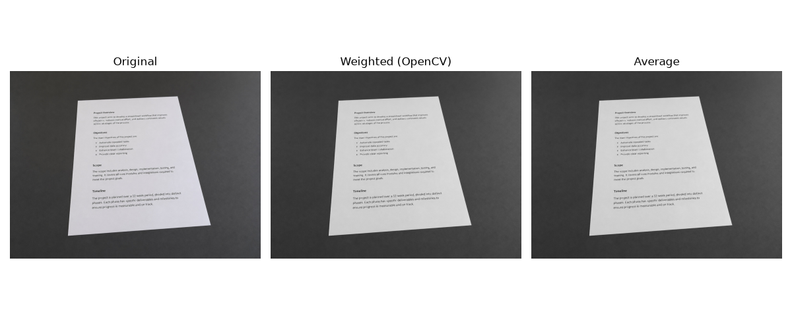
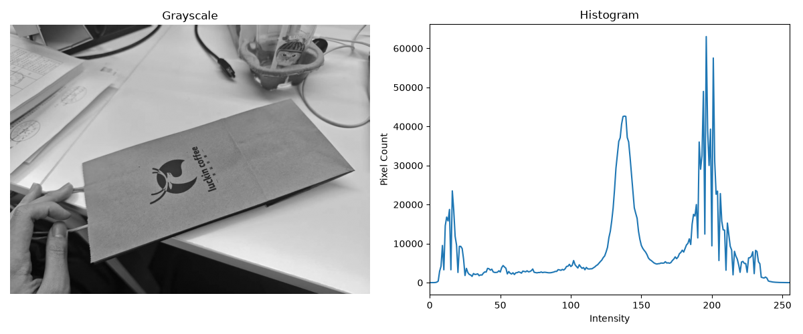
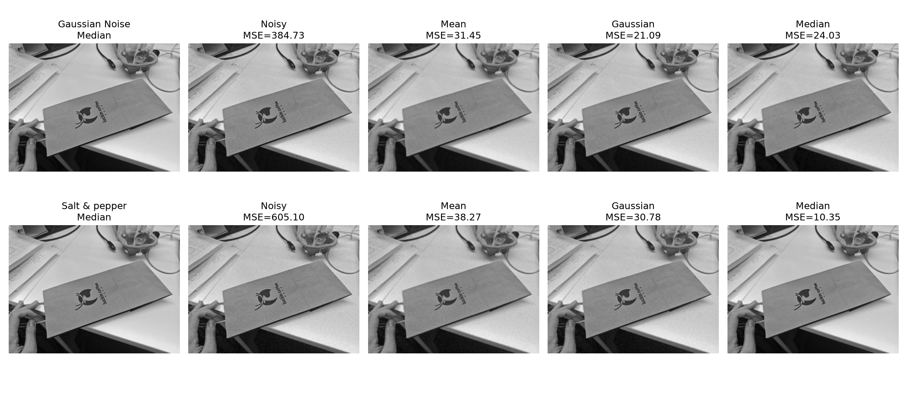
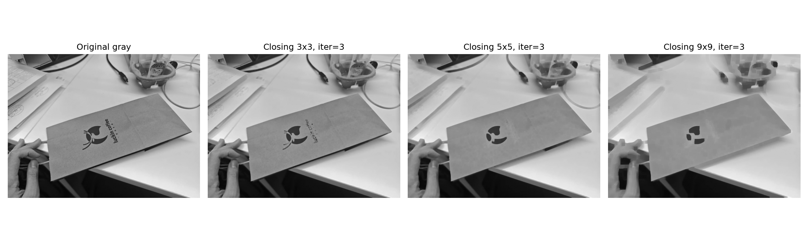
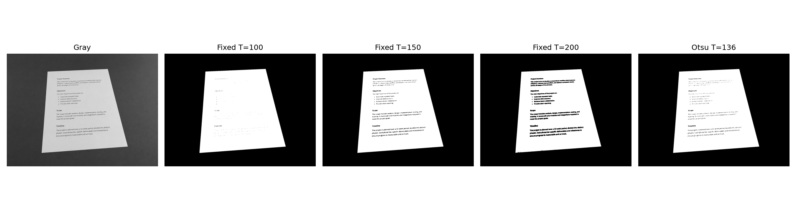
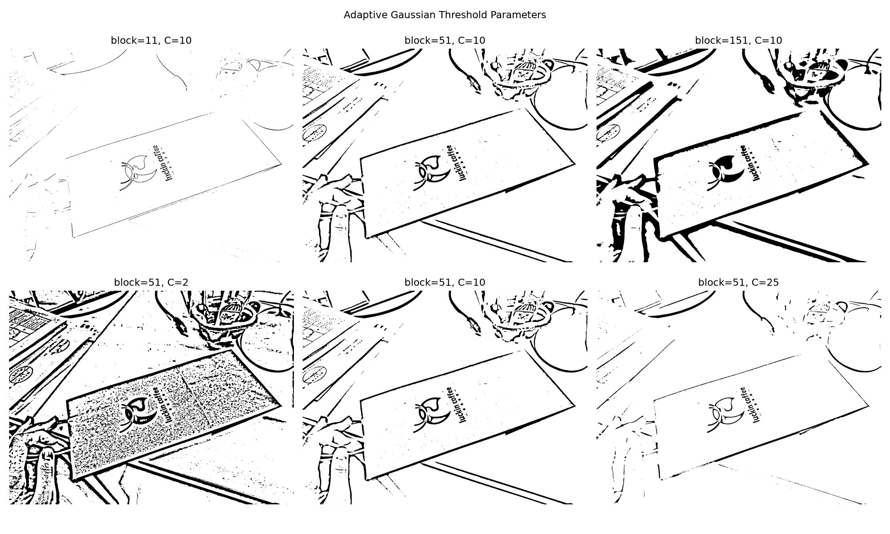
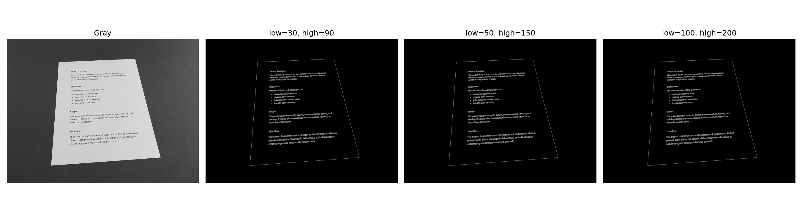
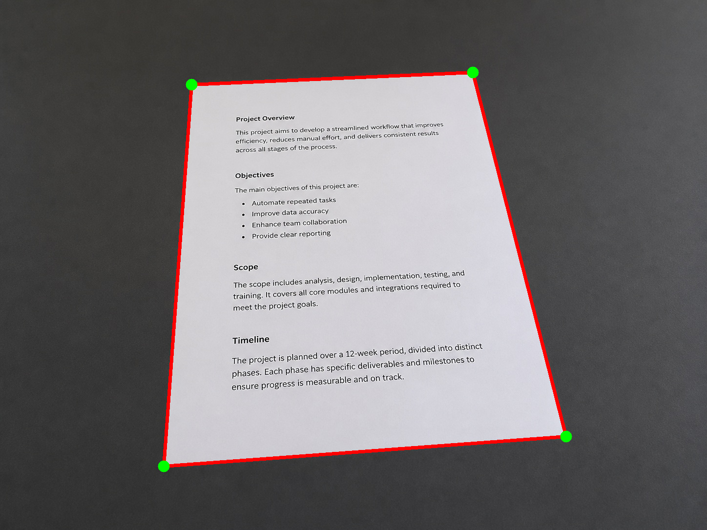
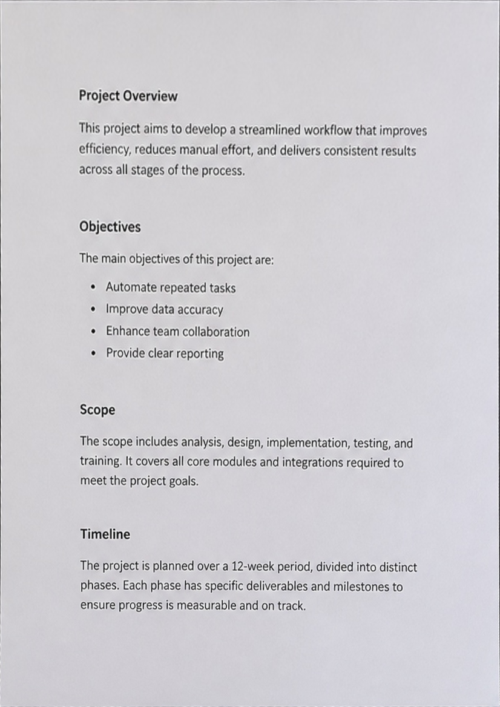
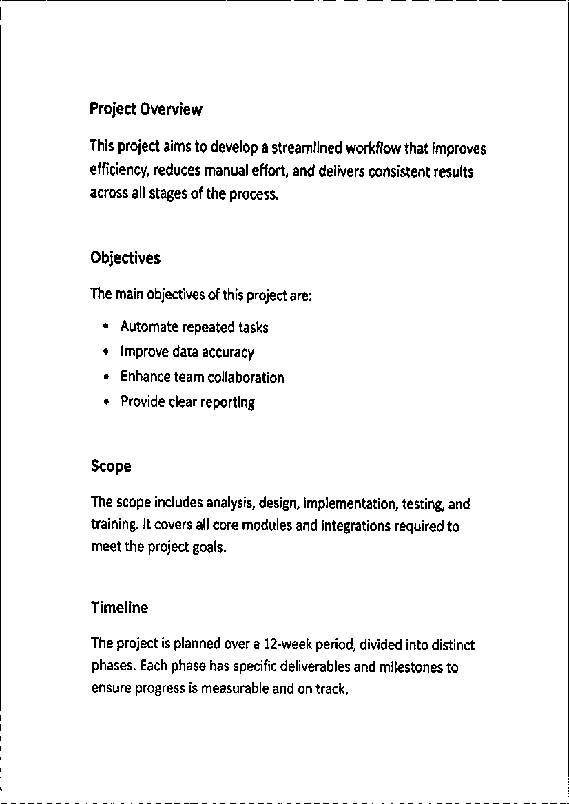

# LearnOpenCV 文档扫描器学习项目

以 Automatic Document Scanner 为主线，在 7 天内学习传统数字图像处理，并实现一个可演示的手机文档扫描器。

当前状态：**Day 5 / 7 进行中**。传统视觉版自动文档扫描链路已经接通，正在加入鲁棒性、失败检测和诊断信息。

## 最终目标

输入一张手机拍摄的文档照片，程序能够：

- 展示灰度、滤波、边缘、候选轮廓和角点等中间结果；
- 自动检测文档四边形边界；
- 对角点排序并完成透视校正；
- 输出灰度或黑白扫描结果；
- 通过 Streamlit 界面上传图片并下载结果；
- 自动检测失败时给出明确提示。

参数滑块、手动角点修正和多种传统方法对比属于时间允许时再完成的扩展功能。

## 学习进度

| 天数 | 主题 | 状态 |
|---|---|---|
| Day 1 | 图像矩阵、BGR/RGB、灰度化、HSV、ROI、缩放、坐标映射、直方图 | 已完成 |
| Day 2 | 噪声、均值/高斯/中值滤波、形态学操作、固定阈值与 Otsu | 已完成 |
| Day 3 | 自适应阈值、Canny 边缘、轮廓检测、面积与四边形筛选 | 已完成 |
| Day 4 | 角点排序、Homography、透视变换 | 已完成 |
| Day 5 | 完整传统视觉流水线、扫描结果增强、失败检测 | 进行中 |
| Day 6 | Streamlit 界面、过程展示和文件下载 | 未开始 |
| Day 7 | 多场景测试、问题修复、演示与文档整理 | 未开始 |

详细实验记录、理解难点和踩坑过程位于 [`learning_logs/`](learning_logs/)。

## Day 1 实验

| 文件 | 内容 |
|---|---|
| [`work/day01_matrix.py`](work/day01_matrix.py) | 手工创建像素矩阵，验证 BGR 通道和像素索引 |
| [`work/day01_grayscale.py`](work/day01_grayscale.py) | 手工灰度化、OpenCV 灰度化、BGR/RGB 和 HSV 对比 |
| [`work/day01_roi.py`](work/day01_roi.py) | ROI 裁剪、图像坐标系、切片视图与 `.copy()` |
| [`work/day01_resize.py`](work/day01_resize.py) | 等比例缩放及小图坐标到原图坐标的映射 |
| [`work/day01_histogram.py`](work/day01_histogram.py) | 灰度直方图、分位数与稳健动态范围 |

部分实验结果：





## Day 2 实验

| 文件 | 内容 |
|---|---|
| [`work/day02_noise.py`](work/day02_noise.py) | 可控高斯/椒盐噪声、三种滤波器及核大小对比 |
| [`work/day02_morphology.py`](work/day02_morphology.py) | 腐蚀、膨胀、开闭运算及结构元素尺度实验 |
| [`work/day02_threshold.py`](work/day02_threshold.py) | 固定阈值与 Otsu 全局阈值对比 |

部分实验结果：







## Day 3 实验

| 文件 | 内容 |
|---|---|
| [`work/day03_adaptive_threshold.py`](work/day03_adaptive_threshold.py) | Otsu 与均值/高斯自适应阈值对比 |
| [`work/day03_adaptive_parameters.py`](work/day03_adaptive_parameters.py) | `blockSize` 与 `C` 的控制变量实验 |
| [`work/day03_canny.py`](work/day03_canny.py) | Canny 双阈值与边缘数量、连续性对比 |
| [`work/day03_contours.py`](work/day03_contours.py) | 闭运算、轮廓面积排序、多边形近似与文档候选筛选 |

部分实验结果：







## Day 4 实验

| 文件 | 内容 |
|---|---|
| [`work/day04_perspective.py`](work/day04_perspective.py) | 角点排序、目标尺寸、Homography，以及旋转、镜像和交叉错序实验 |
| [`work/day04_scanner.py`](work/day04_scanner.py) | 自动寻找文档角点、A4 比例透视展开与黑白扫描结果生成 |

部分实验结果：





## 当前技术结论

- OpenCV 彩色图像使用 `(H, W, 3)` 的 BGR 数组，灰度图通常使用 `(H, W)` 的单通道数组。
- NumPy 图像索引使用 `[y, x]`，OpenCV 几何坐标通常使用 `(x, y)`。
- `axis=2` 表示沿颜色通道轴归约，使每个像素的三个通道合并为一个值。
- 普通 NumPy ROI 切片通常与原图共享内存；需要保留原图时应使用 `.copy()`。
- 检测阶段可缩小图片以减少计算量，再将角点按实际宽高比例映射回原图。
- 灰度权重会改变纸张与背景的亮度梯度，因此原图存在颜色差异不代表灰度后一定具有清晰边界。
- 全局直方图只统计亮度数量，不保留像素位置；比较具体物体时需要使用 ROI 或掩膜。
- 高斯、均值和中值滤波各有适用条件；最低全局 MSE 不一定对应最清楚的文字或边界。
- 结构元素过大或迭代过多会改写真实几何结构，产生块状区域和假轮廓。
- 早期实拍样例上，Otsu 自动得到 `T=108`，与固定 `T=100` 接近；若只提取纸袋整体，`T=150` 更清楚，但内部细节损失更多。
- Canny 阈值控制梯度边缘的接受标准；降低阈值会增加弱边缘和噪声，提高阈值则可能令目标边界断裂。
- `findContours()` 不会主动跨越断点；闭运算只能连接有限尺度的缺口，无法恢复被遮挡而不存在的边缘。
- 当前清晰训练图通过相对面积、四顶点和凸性筛选得到文档候选，轮廓面积约占全图 `34.2%`，并稳定近似出四个角点。
- Homography 通过四组有序对应点将斜拍文档映射到目标矩形；点序循环错位会旋转，环绕方向反转会镜像，交叉顺序会产生严重扭曲。
- 输出画布的 `(width,height)` 必须与目标点坐标范围一致；已知纸张规格时应显式使用真实宽高比，避免仅按图像边长估计造成比例失真。
- 当前扫描脚本可自动检测基础样例、按 A4 比例展开，并在展开后使用自适应阈值生成黑白扫描件。

## 项目结构

```text
learnopencv-study/
├─ inputs/             # 本地测试图片
├─ outputs/            # 实验生成的中间图和结果
├─ work/               # 每日实验代码
├─ learning_logs/      # 每日学习记录、理解难点和踩坑
├─ requirements.txt    # Python 依赖
└─ README.md
```

## 开发环境

- Windows + VS Code
- Python 3.11.9
- OpenCV 5.0.0
- NumPy 2.4.6
- Matplotlib 3.11.1

项目使用独立虚拟环境 `.venv`。在 PowerShell 中安装依赖：

```powershell
.\.venv\Scripts\Activate.ps1
python -m pip install -r requirements.txt
```

将测试照片保存为 `inputs/document.jpg`，然后从项目根目录运行某个实验，例如：

```powershell
python work/day01_grayscale.py
python work/day01_roi.py
python work/day01_resize.py
python work/day01_histogram.py
python work/day02_noise.py
python work/day02_morphology.py
python work/day02_threshold.py
```

生成结果保存在 `outputs/`。当前脚本使用固定输出文件名，切换测试图片时会覆盖上一次结果。

## 测试原则

项目最终至少使用以下场景验证：

- 正常光照与清晰背景；
- 文档旋转或存在明显透视；
- 阴影覆盖文档；
- 纸张与背景亮度接近；
- 背景纹理复杂；
- 文档角点缺失或超出画面，用于验证失败提示。

## 参考资料与来源说明

- [Automatic Document Scanner using OpenCV](https://learnopencv.com/automatic-document-scanner-using-opencv/)
- [LearnOpenCV GitHub repository](https://github.com/spmallick/learnopencv)

本项目以教程的处理思路作为学习参考，代码按每日实验逐步独立实现，不直接复制完整成品。若后续需要引入外部代码、图片或其他资源，应先检查对应文件或目录的许可证，并在此处保留作者、来源和修改说明。

`inputs/document.jpg` 是 2026-09-02 使用 OpenAI 内置图像生成工具制作的合成训练图片，用于提供四角完整可见、无物体遮挡且带透视的基础文档检测场景。
